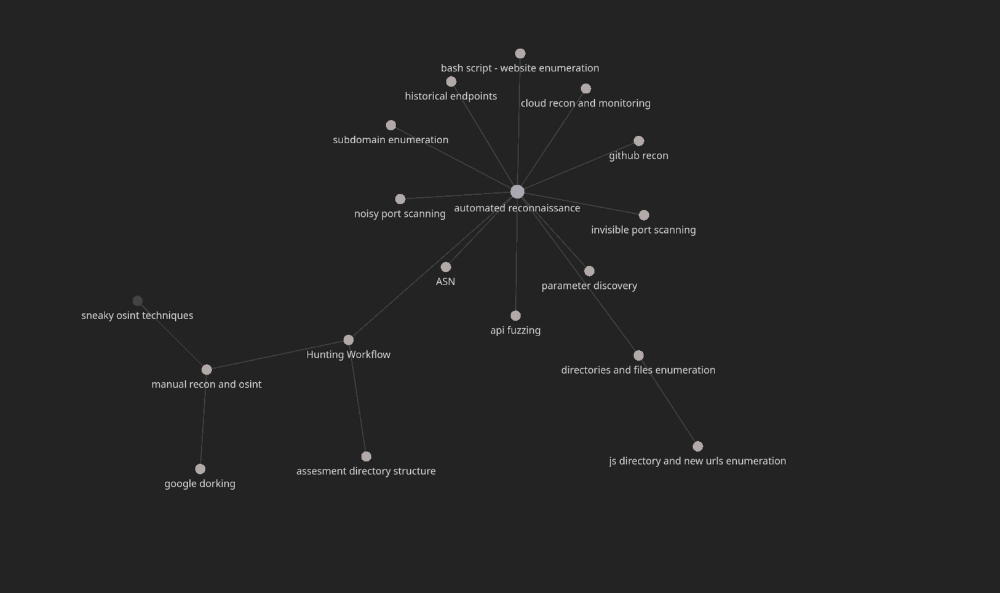

## kali linux docker cli first use:
```sh
  docker run --mount type=bind,src=/<host-path>/kali-workspace,dst=/kali-workspace --tty --interactive --name kali-jeyjey kalilinux/kali-rolling
```

```sh
  apt update && apt -y install kali-linux-headless
```
