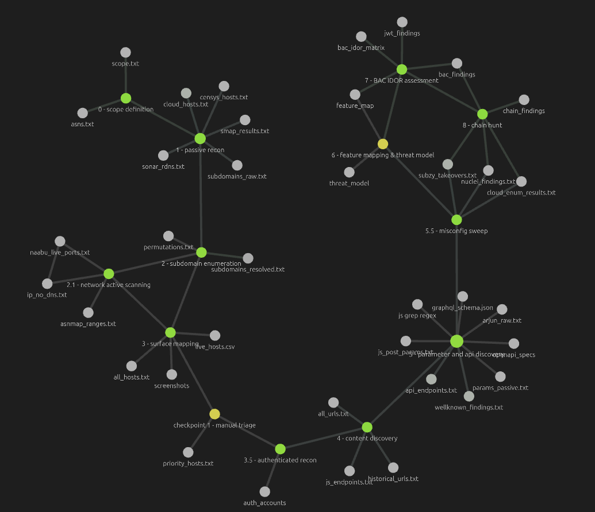

# web_hacking

Linear, phased pipeline where each stage consumes the previous stage's output directly. **Intentionally semi-automated** — chaining outputs manually surfaces infrastructure insights and BAC opportunities that fully automated pipelines miss.

For the full dataflow notes and per-phase commands, open `/obsidian/dataflow_recon/` in Obsidian.

---

## reconnaissance dataflow



---

## directory structure

```
engagements/
└── target_com/
    ├── scope.txt
    ├── asns.txt                          
    │
    ├── phase1_passive/
    │   ├── subdomains_raw.txt            (subfinder)
    │   ├── cloud_hosts.txt               (kaeferjaeger SSL snapshots)
    │   ├── smap_results.txt
    │   ├── censys_hosts.txt              (optional)
    │   ├── sonar_rdns.txt                (optional — IP scope only)
    │   └── github_secrets.txt            (trufflehog github)
    │
    ├── phase2_subdomains/
    │   ├── subdomains_merged.txt
    │   ├── subdomains_resolved.txt       (puredns)
    │   └── permutations.txt              (alterx — conditional)
    │
    ├── phase2.1_network_active/          (only when IP scope present)
    │   ├── asnmap_ranges.txt
    │   ├── naabu_live_ports.txt
    │   └── ip_no_dns.txt
    │
    ├── phase3_surface/
    │   ├── all_hosts.txt
    │   ├── live_hosts.csv                (httpx -tech-detect)
    │   └── screenshots/                  (gowitness)
    │
    ├── priority_hosts.txt                (manual triage from checkpoint 1)
    │
    ├── phase3.5_auth/                    
    │   ├── auth_accounts.md              (account roster, seed IDs per role)
    │   └── (tokens live in ~/.bbp_creds/<target>.env)
    │
    ├── phase4_content/
    │   ├── historical_urls.txt           (gau)
    │   ├── js_endpoints.txt              (jsluice)
    │   ├── all_urls.txt
    │   └── (JXScout cache lives in ~/.jxscout/<target>/)
    │
    ├── phase5_params/
    │   ├── params_passive.txt            (unfurl on gau output)
    │   ├── api_endpoints.txt
    │   ├── openapi_specs/
    │   ├── graphql_schema.json
    │   ├── js_post_params.txt            
    │   ├── wellknown_findings.txt
    │   └── interesting/
    │       ├── gf_ssrf.txt
    │       └── gf_redirect.txt
    │
    ├── phase5.5_misconfig/               
    │   ├── nuclei_findings.txt           (tag-restricted: exposure,token,takeover)
    │   ├── subzy_takeovers.txt
    │   └── cloud_enum_results.txt
    │
    ├── feature_map.md                   
    ├── threat_model.md
    │
    ├── phase7_assessment/                
    │   ├── bac_findings.md
    │   ├── jwt_findings.md               (when JWT in use)
    │   └── saml_findings.md              (when SAML in scope)
    │
    ├── phase8_chains/                    
    │   └── chain_findings.md             
    │
    └── findings/
 
```

---

## the BAC-focused phase flow

```
phase 0  scope          bbscope, manual brief review
phase 1  passive        subfinder, kaeferjaeger, trufflehog (github + postman), smap
phase 2  subdomains     puredns + alterx (conditional)
phase 2.1 network       naabu + asnmap (only if IP/ASN scope)
phase 3  surface        httpx -tech-detect, gowitness
─── checkpoint 1: manual screenshot review + priority scoring ───
phase 3.5 auth          3 accounts × 2 tenants, PwnFox, Caido sessions     
phase 4  content        gau + JXScout + jsluice
phase 5  params/api     unfurl, arjun (optional), openapi/graphql probe, mobile APK
phase 5.5 misconfig     nuclei tag-restricted, subzy, cloud_enum            
phase 6  feature map    manual ≥30 min per role × per tenant (Douglas Day)
phase 7  BAC assessment Autorize/AuthMatrix/Auth Analyzer + BAC matrix      
phase 8  chain hunt     match against catalog, chain low → critical        
findings → Bugcrowd report with VRT pre-pick + chain narration
```

---

## kali docker

Kali Linux container. Good for using clouds as infrastructure and fuzzing with clusters. Container does NOT run JXScout — that daemon runs on the host alongside Caido.

**setup**

```bash
cd kali-docker
chmod +x run.sh
./run.sh
```

**re-attaching**

```bash
docker start kali && docker attach kali
```

See `kali-docker/tools` for the current required tool list.
