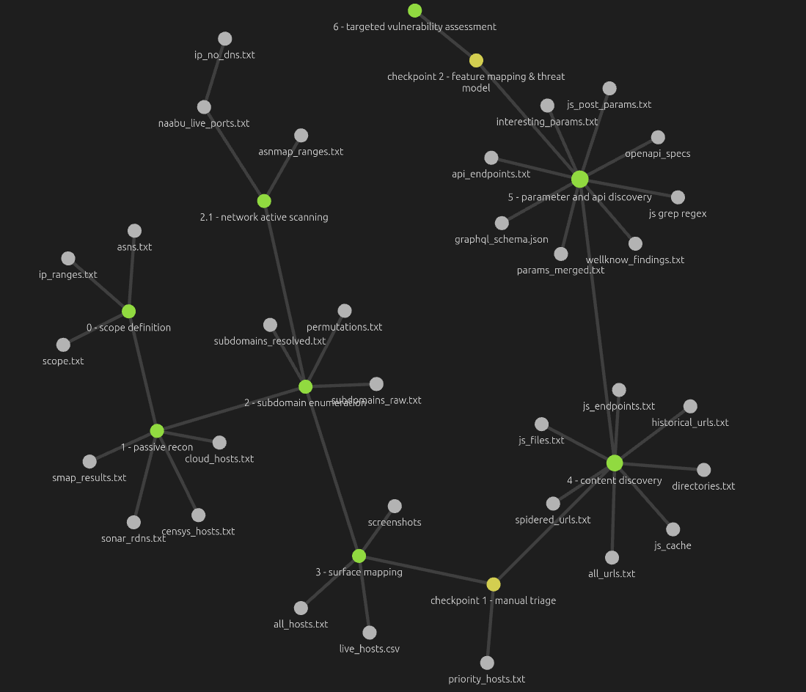

# web_hacking

Personal reconnaissance framework and methodology notes for bug bounty hunting.
Built around a linear, phased pipeline where each stage consumes the previous stage's output directly.
The process is intentionally semi-automated -> chaining outputs manually providing infrastructure insights that fully automated pipelines miss. To view the notes of the dataflow and the commands of the tools i use to produce this data open the directory /obsidian/dataflow_recon with obsidian app.

---

## reconnaissance dataflow



---

## directory structure

```
engagements/
└── target_com/
    ├── scope.txt
    ├── asns.txt
    │
    ├── phase1_passive/
    │   ├── cloud_hosts.txt
    │   ├── censys_hosts.txt
    │   ├── smap_results.txt
    │   ├── ip_ranges.txt
    │   └── sonar_rdns.txt
    │
    ├── phase2_subdomains/
    │   ├── subdomains_raw.txt
    │   ├── permutations.txt
    │   └── subdomains_resolved.txt
    │
    ├── phase2.1_network_active/
    │   ├── asnmap_ranges.txt
    │   ├── naabu_live_ports.txt
    │   └── ip_no_dns.txt
    │
    ├── phase3_surface/
    │   ├── all_hosts.txt
    │   └── live_hosts.csv
    │   └── screenshots/   
    │
    ├── priority_hosts.txt
    │
    ├── phase4_content/
    │   ├── historical_urls.txt
    │   ├── spidered_urls.txt
    │   ├── directories.txt
    │   ├── js_files.txt
    │   ├── js_cache/
    │   ├── js_endpoints.txt
    │   └── all_urls.txt
    │
    ├── phase5_params/
    │   ├── params_merged.txt
    │   ├── api_endpoints.txt
    │   ├── wellknown_findings.txt
    │   ├── openapi_specs/
    │   ├── graphql_schema.json
    │   ├── js_post_params.txt
    │   └── interesting/
    │       ├── gf_ssrf.txt
    │       ├── gf_redirect.txt
    │       └── gf_xss.txt
    │
    ├── feature_map.md
    │
    └── findings/
        ├── ssrf/
        ├── idor/
        ├── open_redirect/
        └── xss/
```

**scope and root files**

`scope.txt` lists all apex domains in scope, one per line. `asns.txt` holds the ASN numbers discovered during scope definition via bgp.he.net or ARIN. `ip_ranges.txt` contains the CIDR blocks derived from those ASNs.

**phase1_passive**

Zero-footprint intelligence gathering. `cloud_hosts.txt` is extracted from kaeferjaeger's weekly SSL certificate snapshots of cloud provider IP ranges. `censys_hosts.txt` contains host and port data from the Censys API. `smap_results.txt` holds Shodan-backed passive port data. `sonar_rdns.txt` is built from Rapid7's Project Sonar RDNS dataset cross-referenced against `ip_ranges.txt`; its key value is surfacing IPs that once had DNS records but no longer do.

**phase2_subdomains**

DNS-track host discovery. Each tool writes its own raw output file for auditing. `subdomains_raw.txt` is the merged and deduplicated result of all tool outputs. `permutations.txt` is generated by altdns and dnsgen from the merged list, producing name variations that no passive source would contain. `subdomains_resolved.txt` is the final output — only hosts that returned a valid DNS resolution via dnsx.

**phase2.1_network_active**

Not every program is okay with you probing ports like a maniac in their network so do this phase carrefully, this can become really noisy. Runs in parallel with phase 2 and converges at phase 3. `asnmap_ranges.txt` is the full CIDR expansion of `asns.txt`. `naabu_live_ports.txt` contains IP:port pairs that responded on web-relevant ports (80, 443, 8080, 8443, 4443, 8888, 9000). `nmap_banners.txt` holds service and version banners. `ip_no_dns.txt` is the critical output — IPs that responded to the port scan but have no corresponding entry in `subdomains_resolved.txt`. These are hosts with no DNS record: forgotten staging environments, legacy infrastructure, shadow IT. Produced by diffing naabu output against the resolved subdomain list. This phase cover and focus in web servers ports, if you find an host that have other services running you can go deep on them, but in bug bounty targets thats is probably unlikely to happen.

**phase3_surface**

Convergence point for both the DNS track (phase 2) and the IP track (phase 2.1). All discovered hosts are merged and probed identically with httpx. `live_hosts.csv` contains status code, title, technology stack, web server, ASN, and content length for every live host. `screenshots/` holds gowitness output for every host in the CSV.

**priority_hosts.txt**

Manually curated after reviewing gowitness screenshots. Hosts annotated as high, medium, or skip. Hosts originating from `ip_no_dns.txt` deserve extra attention — they are not visible to hunters using standard subdomain enumeration. All subsequent phases operate only against this list.

**phase4_content**

URL and content discovery. `historical_urls.txt` is the merged output of gau and waybackurls — entirely passive, queries public archives only. `spidered_urls.txt` is the active bbot spider output. `directories.txt` is the ffuf directory brute force result. `js_files.txt` contains filtered, validated live JS URLs. `js_cache/` holds locally downloaded JS bundle files named by MD5 hash to avoid collisions. `js_endpoints.txt` contains internal endpoints extracted from those bundles via linkfinder and collector.py. `all_urls.txt` is the single source of truth — everything merged via anew.

**phase5_params**

Parameter and API surface discovery. `paramspider_raw.txt` is sourced from the Wayback Machine (passive). `arjun_raw.txt` is the result of active hidden parameter discovery. `params_merged.txt` unifies all GET parameters. `api_endpoints.txt` is the kiterunner API route brute force output against assetnote route datasets. `wellknown_findings.txt` covers probed `/.well-known/` paths: openid-configuration, security.txt, assetlinks.json, change-password, mta-sts.txt. `openapi_specs/` holds any swagger or openapi schema dumps found at common paths. `graphql_schema.json` is the result of a GraphQL introspection query when applicable. `js_post_params.txt` contains server-side URL patterns extracted by grepping the JS cache for fetch/axios POST calls with url-shaped body parameters and verbs such as proxy, import, render, webhook, and screenshot (i like to look for SSRF so i use this frontend resource code like that). The `interesting/` subdirectory holds gf pattern matches pre-filtered by vulnerability class for manual review.

**feature_map.md**

The goal is to understand the application products and behaviour. Built manually at the second checkpoint. Maps application features: auth flows, user roles, file uploads, redirects, payment logic, URL-consuming endpoints. Defines the threat model for the target —> what is the worst that could happen to this organization? — and redirects phase 6 effort accordingly.

**findings/**

One subdirectory per vulnerability class. Each confirmed finding lives here with request/response evidence and impact notes.

---

## kali docker

The hacking environment i use runs inside a Kali Linux container. This is good for using clouds as infrastructure and fuzzing with clusters

**setup**

```bash
cd kali-docker
chmod +x run.sh
./run.sh
```

**re-attaching**

```bash
docker start kali && docker attach kali
```
